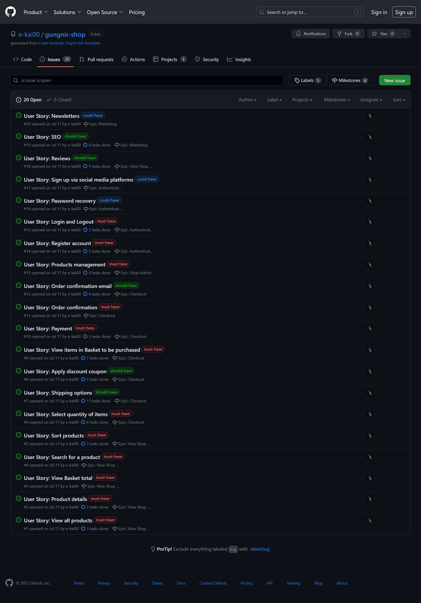
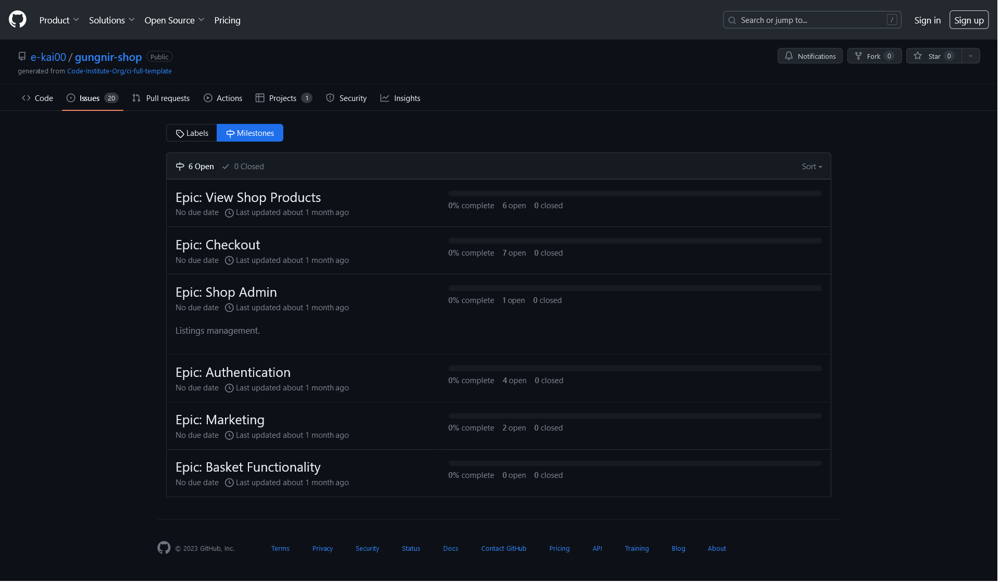
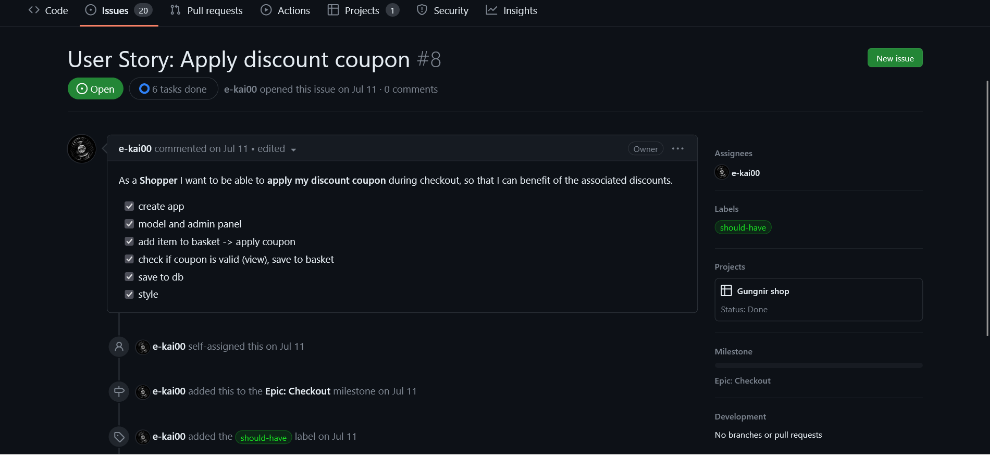
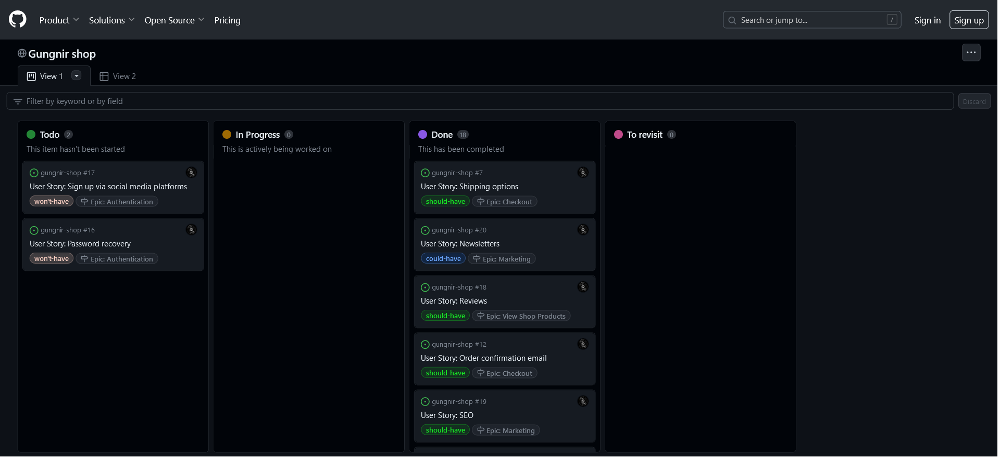
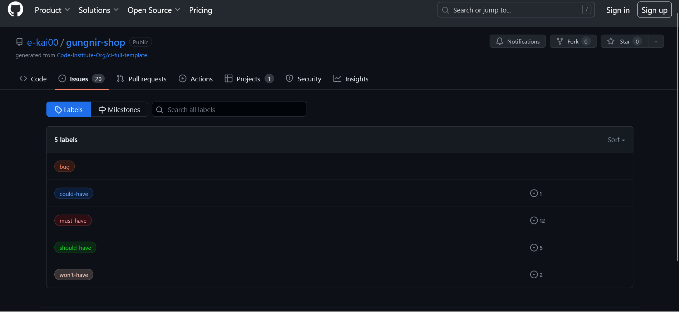

# Gungnir Shop


## Concept

### Business Model
Gungnir Shop is a customer-centric (B2C) e-commerce  venture that sells unique handcrafted jewelry. By bringing unique creations online, the business connects with a global audience that appreciates the artistry and dedication behind each piece.

The live link to the website - [Gungnir Shop](https://gungnir-shop-d9723ee6b3ec.herokuapp.com/)


### Core Business Intents:
- Offer unique handmade jewelry -  presents a curated collection of handmade jewelry that exemplify artistry and originality.

- Showcase the artist's craftsmanship - highlighs the artisan's craftsmanship. Every piece of the collection showcases the artist's meticulous attention to detail, allowing customers to appreciate the journey from concept to creation.

- Provide exceptional customer experience - offers customers an exceptional online shopping experience. The website features intuitive navigation, comprehensive product details, vibrant imagery, and a hassle-free checkout process.

### Marketing Strategies:

To assist with business promotion the following strategies have been put in place:

- Facebook Page linked to the site. It can serve as an online gallery of jewelry creations. Regular posts featuring high-quality images, behind-the-scenes glimpses into the creative process, customesrs review will help to foster a community that shares a passion for artisanal jewelry.

- Newsletter subscription (via Mailchimp). Customers have the opportunity to subscribe to the newsletter, which allows them to gain exclusive access to new jewelry releases and upcoming promotions. This subscription-based communication will help to deepen the connection with the audience.

- Discounts and special offers. The online-shop is equipped to accept coupon codes. Periodic discounts and special offers, announced via social networks, newsletters or in the website's announcements section will help to gain new customers and encourage repeat purchases.


### SEO

The website's SEO strategy focuses on maximizing visibility and accessibility:

- Keyword strategy: a combination of short-tail and long-tail keywords specific to this business were chosen and integrated into meta tags. 
I also made sure that images have clear names and alt tags to help everyone see and understand them better.


- Semantic HTML: the website content is organized with appropriate tags, adhering to best practices. I limited the use of `<h>` tags solely to hierarchical structure rather than stylistic purposes. In instances where the `<section>` tag was used, I linked it via aria-labeledby or area-labeled (aligning with the guidelines of [W3C(WAI)](https://www.w3.org/WAI/ARIA/apg/practices/landmark-regions/)).

- Technical foundations: robots.txt and sitemap.xml files are included into the project to guide search engine crawlers and contribute to the proper indexing of the website's content.


## UX Design

I aimed to create a clean and simple design for the Gungnir Shop project, focusing on making the website easy to use. The interface has a simple layout with easy-to-understand navigation, so users can manage their shopping easily. The design is kept simple to prevent things from getting too crowded and to avoid any unnecessary distractions.

### Color Scheme

The color scheme for this project is designed to be crisp and fresh.<br>

Background is a clean white, providing a canvas of clarity.<br>
*#80020* - a rich burgundy, used as a main color to contrast the background.<br>
*#222222* - a deep grey represents essential text, ensuring effortless readability.<br>
*#f6f6e1* - a delicate beige hue serves to elegantly contrast text on darker backgrounds.<br>


### Typography

Three [Google Fonts](https://fonts.google.com/) were used for the website:

- Yuji Boku - used for logo 
- Montserrat - used as default
- Ysabeau Infant - used for secondary font

### Icons

- [FontAwesome](https://fontawesome.com/) icon library is used to enhance the visual appeal and usability of the website.


### Wireframes

I began with initial sketches on paper, which then transfered into wireframes for both desktop and mobile layouts using [Balsamiq](https://balsamiq.com/) mockup tool.

| home page | product details page |
|:--:|:--:|
|||

| basket page | profile page |
|:--:|:--:|
|||

## Agile Development

I used the Agile methodology for the management of this project. Below is an overview of how Agile principles were integrated into the management of this project.

- **User Stories and Issues**

  I utilized "Issues" functionality on GitHub to create user stories. Each user story represented a specific feature or functionality desired by the end-users. These user stories formed the foundation of the project's scope and guided the development process.

  <details><summary>user stories</summary>
  
  </details>

<br>

- **Epics, Stories, and Tasks**

  In order to better organize and categorize the user stories, they were grouped into larger themes known as epics. Epics helped provide a high-level view of the project's goals and allowed for more effective management of related user stories. Each story was further broken down into individual tasks, ensuring better task tracking.

  <details><summary>epics</summary>
  
  </details>
  <details><summary>tasks</summary>
  
  </details>

<br>

- **Kanban Board for Task Management**

  Throughout the project, a [Kanban Board](https://github.com/users/e-kai00/projects/4/views/1) was utilized to visualize and manage tasks. The Kanban Board provided a clear visual representation of the project's workflow, from the initial backlog of user stories to the various stages of development.

  <details><summary>Kanban board</summary>
  
  </details>

<br> 

  - **MoSCoW Prioritization**

    To effectively manage and prioritize requirements, the MoSCoW Prioritization technique was employed. This method categorizes requirements into four distinct categories: Must-Have, Should-Have, Could-Have, and Won't-Have. 

  <details><summary>MoSCoW prioritization</summary>
  
  </details>


## Features

### Existing Features
### Features left to implement

## Technology 

- [VS Code](https://code.visualstudio.com/) - used as my primary IDE.
- [GitHub](https://github.com/) - used as remote online storage of my code.
- [Balsamiq](https://balsamiq.com/) - used for wireframes

### Front-End 

- HTML - base markup language
- CSS - base cascading style sheets
- [jQuery](https://jquery.com/) - used for JavaScript functionality
- [Bootstrap](https://getbootstrap.com/docs/4.0/getting-started/introduction/) - used as frontend framework
- [FontAwesome](https://fontawesome.com/) - used as icon library
- [Google Fonts](https://fonts.google.com/) - used for project fonts


### Back-End

- [Django](https://docs.djangoproject.com/en/3.2/) - used as main framework
- [Heroku](https://www.heroku.com/) - used as app remote hosting platform
- [Python](https://www.python.org/) - used as backend programming language
- [ElephantSQL](https://www.elephantsql.com/) - remote PostgreSQL database
- [AWS](https://https://aws.amazon.com/) - used for static files as remote storage <br><br>

## Testing

For an overview of all the testing conducted, please refer to the [TESTING.md](https://github.com/e-kai00/gungnir-shop/blob/main/TESTING.md) file.


## Deployment

### Local Deployment
 
**Clone the repositary:**
- go to the [gungnir-shop](https://github.com/e-kai00/gungnir-shop) repositary
- click on the "Code" button, located just above the file list
- in the dropdown menu, click on the clipboard icon to copy the repository's URL
- open the terminal in your code editor and navigate to the directory where you want to clone the repository
- run the following command:
  - `git clone https://github.com/e-kai00/gungnir-shop.git`
- install packages from the [requirements.txt](https://github.com/e-kai00/gungnir-shop/blob/main/requirements.txt) file using this command:
  - `pip3 install -r requirements.txt`
- create a `.env` file for your own credentials
- to launch the Django app, run command:
  - `python3 manage.py runserver`
- to stop the app:
  - `CTRL+C`
- make migrations to set up the database:
  - `python3 manage.py makemigrations`
  - `python3 manage.py migrate`  
- create superuser to access the Django Admin Panel:
  - `python3 manage.py createsuperuser`

After successfully completing the database migrations and setting up the superuser, the relational schema will be configured:


**ElephantSQL Database**

To sign up with ElephantSQL and create a new database, you follow these steps:

- go to the ElephantSQL  [ElephantSQL](https://www.elephantsql.com/) website
- sign-up with your GitHub account
- click **Create new instance**
- enter a name and choose plan (recommended free Tiny Turtle)
- select the region and data center closest to you
- once created, click on the new database name to view the database URL
- use the database URL as a credential in your `.env` file

**AWS (Amazon Web Services)**

- Sign-up or sign-in [AWS](https://aws.amazon.com/console/) 
- Create Bucket. Options to choose:  
  - Object Ownership: 
    - ACLsenabled
    - Bucket owner preferred
    - Uncheck "Block all public access"
- Set up bucket:
  - Property tab:
    - Choose "Static website hosting"
  - Permission tab:
    - Configurate CORS
    - Add Bucket policy
    - In "Access control list" section enable "List" for "Eceryone (public access")
-  Identity and Access Management (IAM)
  - Create group
  - Create policy and attach it to the Group
  - Create user
  - Retrieve access key: 
    - Go to IAM and select "Users"
    - Select the user for whom you wish to create a CSV file.
    - Select the "Security Credentials" tab
    - Scroll to "Access Keys" and click "Create access key". Select "Application running outside AWS"
    - You can leave the "Description tag" value blank. Click "Create Access Key"
    - Downlod csv file
- Connect Django and Bucket:
  - `pip3 install boto3`  
  - `pip3 install django-storages`  
  - Django settings.py: 
    - add 'storages' to the app list
    - add following configurations
    ``` 
    # Bucket Config
    AWS_STORAGE_BUCKET_NAME = 'gungnir-shop'
    AWS_S3_REGION_NAME = 'eu-central-1'
    AWS_ACCESS_KEY_ID = os.environ.get('AWS_ACCESS_KEY_ID')
    AWS_SECRET_ACCESS_KEY = os.environ.get('AWS_SECRET_ACCESS_KEY')
    AWS_S3_CUSTOM_DOMAIN = f'{AWS_STORAGE_BUCKET_NAME}.s3.amazonaws.com'

    # Static and media files
    STATICFILES_STORAGE = 'custom_storages.StaticStorage'
    STATICFILES_LOCATION = 'static'
    DEFAULT_FILE_STORAGE = 'custom_storages.MediaStorage'
    MEDIAFILES_LOCATION = 'media'
    
    STATIC_URL = f'https://{AWS_S3_CUSTOM_DOMAIN}/{STATICFILES_LOCATION}/'
    MEDIA_URL = f'https://{AWS_S3_CUSTOM_DOMAIN}/{MEDIAFILES_LOCATION}/'
    ```

### Heroku Deployment

This project is deployed on Heroku, a cloud platform. To deploy the project, follow these steps:

- create a [Heroku](https://www.heroku.com/) account
- click **Create New App**
- choose name for your app and region
- once app created, navigate to *Settings* and click **Reveal Config Vars**
- set your environment variables:
  | Key | Value |
  |-----|-------|
  | `SECRET_KEY`| *your_django_secret_key* |
  |`DATABASE_URL`| *your ElephantSQL database URL*|
  | `AWS_ACCESS_KEY_ID`| *your access key ID*|
  |`AWS_SECRET_ACCESS_KEY`|*your secrete access key*|
  |`STRIPE_PUBLIC_KEY`|*your Stripe public key*|
  |`STRIPE_SECRET_KEY`|*your API Stripe secrete key*|
  |`EMAIL_HOST_PASS`|*your host password*|
  |`EMAIL_HOST_USER`|*your email address*|

For proper deployment and execution of the application, Heroku needs *requirements.txt* and *Procfile*:
- `pip3 install -r requirements.txt` - to install project's requirements.txt
- `echo web: gunicorn tracker.wsgi > Procfile` - to create Procfile


*The files for this project can be found here: [requirements.txt](https://github.com/e-kai00/gungnir-shop/blob/main/requirements.txt) and [Procfile](https://github.com/e-kai00/gungnir-shop/blob/main/Procfile)*
  

- Navigate to **Deploy** tab
- Connect your GitHub account and choose needed repositary
- Scroll down and click **Deploy Branch** (this project deployed from main branch)
- Once succeesfully deployed, click **Open app** at the right top coner of the page <br><br>


## Credits

### Content
### Code
### Acknowledgment
