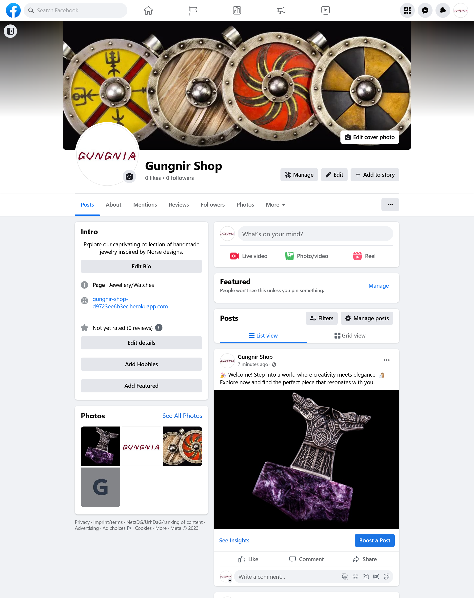

# Gungnir Shop


The live link to the website - [Gungnir Shop](https://gungnir-shop-d9723ee6b3ec.herokuapp.com/)

<br> 

## Table of Contents

- [Concept](#concept)
  - [Business Model](#business-model)
  - [Core Business Intents](#core-business-intents)
  - [Marketing Strategies](#marketing-strategies)
  - [SEO](#seo)
- [Design](#design)
  - [Color Scheme](#color-scheme)
  - [Typography](#typography)
  - [Icons](#icons)
  - [Wireframes](#wireframes)
- [Agile Development](#agile-development)
- [Features](#features)
  - [Existing Features](#existing-features)
  - [Features left to implement](#features-left-to-implement)
- [Technology](#technology)
- [Testing](#testing)
- [Deployment](#deployment)
  - [Local Deployment, EDR](#local-deployment)
  - [Heroku Deployment](#heroku-deployment)
- [Credits](#credits)
  - [Content](#content)
  - [Code](#code)

## Concept

### Business Model
Gungnir Shop is a customer-centric (B2C) e-commerce  venture that sells unique handcrafted jewelry. By bringing unique creations online, the business connects with a global audience that appreciates the artistry and dedication behind each piece.

### Core Business Intents:
- Offer unique handmade jewelry -  presents a curated collection of handmade jewelry that exemplify artistry and originality.

- Showcase the artist's craftsmanship - highlights the artisan's craftsmanship. Every piece of the collection showcases the artist's meticulous attention to detail, allowing customers to appreciate the journey from concept to creation.

- Provide exceptional customer experience - offers customers an exceptional online shopping experience. The website features intuitive navigation, comprehensive product details, vibrant imagery, and a hassle-free checkout process.

### Marketing Strategies:

To assist with business promotion the following strategies have been put in place:

- Facebook Page linked to the site. It can serve as an online gallery of jewelry creations. Regular posts featuring high-quality images, behind-the-scenes glimpses into the creative process, customers review will help to foster a community that shares a passion for artisanal jewelry. The page can be found here - [Gungnir Shop Facebook page](https://www.facebook.com/people/Gungnir-Shop/61550019187443/).

  <details><summary>Gungnir Shop Facebook page (screenshot)</summary>
  
  </details>

<br>

- Newsletter subscription (via Mailchimp). Customers have the opportunity to subscribe to the newsletter, which allows them to gain exclusive access to new jewelry releases and upcoming promotions. This subscription-based communication will help to deepen the connection with the audience.

- Discounts and special offers. The online-shop is equipped to accept coupon codes. Periodic discounts and special offers, announced via social networks, newsletters or in the website's announcements section will help to gain new customers and encourage repeat purchases.


### SEO

The website's SEO strategy focuses on maximizing visibility and accessibility:

- Keyword strategy: a combination of short-tail and long-tail keywords specific to this business were chosen and integrated into meta tags. 
I also made sure that images have clear names and alt tags.


- Semantic HTML: the website content is organized with appropriate tags, adhering to best practices. I limited the use of `<h>` tags solely to hierarchical structure rather than stylistic purposes. In instances where the `<section>` tag was used, I linked it via aria-labeledby or area-labeled (aligning with the guidelines of [W3C(WAI)](https://www.w3.org/WAI/ARIA/apg/practices/landmark-regions/)).

- Technical foundations: *robots.txt* and *sitemap.xml* files are included into the project to guide search engine crawlers and contribute to the proper indexing of the website's content.

<br> 

The live link to the website - [Gungnir Shop](https://gungnir-shop-d9723ee6b3ec.herokuapp.com/)

If you would like to test website functionality:

- to test the "Apply coupon code" functionality, you can use the following code: 
  - coupon10
- to test payment functionality, you can use Stripe test card number:
  -  4242 4242 4242 4242
  - along with a valid future date, any three-digit for CVC and any value you like for other form fields.


## Design

I aimed to create a clean and simple design for this project, focusing on making the website easy to use. The interface has a simple layout with easy-to-understand navigation, so users can manage their shopping easily. The design is kept simple to prevent things from getting too crowded and to avoid any unnecessary distractions.

### Color Scheme

The color scheme for this project is designed to be crisp and fresh.<br>

Background is a clean white, providing a canvas of clarity.<br>
*#80020* - a rich burgundy, used as a main color to contrast the background.<br>
*#222222* - a deep grey represents essential text, ensuring effortless readability.<br>
*#f6f6e1* - a delicate beige hue serves to elegantly contrast text on darker backgrounds.<br>


### Typography

Three [Google Fonts](https://fonts.google.com/) were used for the website:

- Yuji Boku - used for logo 
- Montserrat - used as default
- Ysabeau Infant - used for secondary font

### Icons

- [FontAwesome](https://fontawesome.com/) icon library is used to enhance the visual appeal and usability of the website.


### Wireframes

I began with initial sketches on paper, which then transferred into wireframes for both desktop and mobile layouts using [Balsamiq](https://balsamiq.com/) mockup tool.

| home page | product details page |
|:--:|:--:|
|||

| basket page | profile page |
|:--:|:--:|
|||

## Agile Development

I used the Agile methodology for the management of this project. Below is an overview of how Agile principles were integrated into the management of this project.

- **User Stories and Issues**

  I utilized "Issues" functionality on GitHub to create user stories. Each user story represented a specific feature or functionality desired by the end-users. These user stories formed the foundation of the project's scope and guided the development process.

  <details><summary>user stories</summary>
  
  </details>

<br>

- **Epics, Stories, and Tasks**

  In order to better organize and categorize the user stories, they were grouped into larger themes known as epics. Epics helped provide a high-level view of the project's goals and allowed for more effective management of related user stories. Each story was further broken down into individual tasks, ensuring better task tracking.

  <details><summary>epics</summary>
  
  </details>
  <details><summary>tasks</summary>
  
  </details>

<br>

- **Kanban Board for Task Management**

  Throughout the project, a [Kanban Board](https://github.com/users/e-kai00/projects/4/views/1) was utilized to visualize and manage tasks. The Kanban Board provided a clear visual representation of the project's workflow, from the initial backlog of user stories to the various stages of development.

  <details><summary>Kanban board</summary>
  
  </details>

<br> 

  - **MoSCoW Prioritization**

    To effectively manage and prioritize requirements, the MoSCoW Prioritization technique was employed. This method categorizes requirements into four distinct categories: Must-Have, Should-Have, Could-Have, and Won't-Have. 

    <details><summary>MoSCoW prioritization</summary>
    
    </details>

<br>

## Features

### Existing Features

#### Navbar

  Has a distinctive *logo* that represents the shop, a simple menu featuring *My Account* and *Basket* displaying the total amount of items (if such were added), and an *interactive search bar* that allows users to quickly find relevant content or information within the website.

  

<br>

#### Footer

Has an *About Us* section, *subscription form* for newsletters, and *Contact information* along with links to *social networks*.

  

<br>

#### Home page

Serves as the central hub of the shop, showcasing all products. It is equipped with such features as organizing products in *Collections* and *sorting products by* price and names.

 

The home page includes the *Announcement section*, which is meant to be used for the latest shop's news and updates (announcements are updated by admin).
  


<br>
  
#### Product detail page

Standard product page with product image and description, offering the following features:

- Linked Collection -  displays the *collection tag* to which the product belongs (e.g. "Axe Amulet") and enables users to explore the entire collection with a single click. The *Product Rating* feature displays average product rating.


- Item *quantity buttons* and *add to Basket* button for a quick way to add product to the basket. The *Keep shopping* button returns user to the home page.


- Estimated delivery information, which is based on chosen shipping method (if shipping method is not set by the user, default shipping method, *Standard*, will be used to calculate delivery).


- Customer review section: offers an interactive star-based rating where registered users can post and update their reviews.


<br>

#### Basket page

Has the following features:

- Displaying product image, price, and buttons to easily *adjust quantities* or *remove* items from the basket.
*Grand total* section, which presents a clear overview of total cost of the purchase.


- Providing a dropdown menu to select preferred shipping methods and estimated delivery time.


- Offering a space for users to input coupon codes. 


<br>

#### Checkout and Success page

The Checkout page features a straightforward form that users complete to finalize their orders. Seamlessly integrated with Stripe payment, this page ensures secure and convenient transactions.


Once the order is successfully placed, users are redirected to the Success page, confirming their purchase.


<br>

#### Profile page

Stores *saved Delivery info* and allows to update it.


Stores *Order history* and allows to access completed orders details by clickng an order number.


<br>

#### Admin functionality

The admin toolkit allows to add a new product, edit and delete existing products. On deleting a product, a delete confirmation window pops up to ensure intentional actions.


<br>

#### User registration and authentication

Offers a seamless user experience with registration and authentication features. Users can efficiently create an account, log in and log out.

<br>

#### Messages

The website employs a robust messaging system to efficiently communicate vital notifications regarding users' actions. The *success messages* offer an additional functionality of displaying the current basket's content, enhancing the user experience.


<br>

#### Error page

The website has personalized 404 and 500 error pages that are integrated with the website design and theme.


<br>

### Features left to implement

**User registration and authentication**

- Enable users to change their password, email and delete their profile.
- Password recovery
- Sign up via social media platforms

**Payment**

- Implement Webhooks

**Admin functionality**

- introduce a user-friendly interface that enables admins to perform full CRUD operations on shipping methods
- introduce a user-friendly interface for admins to perform full CRUD functionality on coupon codes management

**Home page**

- improve Announcement section (the issue with the section described in [bugs # 5](https://github.com/e-kai00/gungnir-shop/blob/main/TESTING.md#bugs) section)


**Review Section**

  -  when user updates their existing comment, instead of encountering a blank textarea, the user's previous comment will be pre-filled in the textarea. This improvement eliminates the need for users to retype their entire comment.
  - prevent page reloads when a review is submitted without a rating. Presently, when a review is submitted without a rating, it triggers a page reload, leaving the textarea empty, which might be frustrating for users. 
 


## Technology 

- [VS Code](https://code.visualstudio.com/) - used as my primary IDE.
- [GitHub](https://github.com/) - used as remote online storage of my code.
- [Balsamiq](https://balsamiq.com/) - used for wireframes

### Front-End 

- HTML - base markup language
- CSS - base cascading style sheets
- [jQuery](https://jquery.com/) - used for JavaScript functionality
- [Bootstrap](https://getbootstrap.com/docs/4.0/getting-started/introduction/) - used as frontend framework
- [FontAwesome](https://fontawesome.com/) - used as icon library
- [Google Fonts](https://fonts.google.com/) - used for project fonts
- [Stripe](https://stripe.com/en-de) - used to make secured payments


### Back-End

- [Django](https://docs.djangoproject.com/en/3.2/) - used as main framework
- [Heroku](https://www.heroku.com/) - used as app remote hosting platform
- [Python](https://www.python.org/) - used as backend programming language
- [ElephantSQL](https://www.elephantsql.com/) - remote PostgreSQL database
- [AWS](https://https://aws.amazon.com/) - used for static files as remote storage <br><br>

## Testing

For an overview of all the testing conducted, please refer to the [TESTING.md](https://github.com/e-kai00/gungnir-shop/blob/main/TESTING.md) file.


## Deployment

### Local Deployment
 
**Clone the repository:**
- go to the [gungnir-shop](https://github.com/e-kai00/gungnir-shop) repository
- click on the "Code" button, located just above the file list
- in the dropdown menu, click on the clipboard icon to copy the repository's URL
- open the terminal in your code editor and navigate to the directory where you want to clone the repository
- run the following command:
  - `git clone https://github.com/e-kai00/gungnir-shop.git`
- install packages from the [requirements.txt](https://github.com/e-kai00/gungnir-shop/blob/main/requirements.txt) file using this command:
  - `pip3 install -r requirements.txt`
- create a `.env` file for your own credentials
- to launch the Django app, run command:
  - `python3 manage.py runserver`
- to stop the app:
  - `CTRL+C`
- make migrations to set up the database:
  - `python3 manage.py makemigrations`
  - `python3 manage.py migrate`  
- create superuser to access the Django Admin Panel:
  - `python3 manage.py createsuperuser`

After successfully completing the database migrations and setting up the superuser, the relational schema will be configured:


**ElephantSQL Database**

To sign up with ElephantSQL and create a new database, you follow these steps:

- go to the ElephantSQL  [ElephantSQL](https://www.elephantsql.com/) website
- sign-up with your GitHub account
- click **Create new instance**
- enter a name and choose plan (recommended free Tiny Turtle)
- select the region and data center closest to you
- once created, click on the new database name to view the database URL
- use the database URL as a credential in your `.env` file

**AWS (Amazon Web Services)**

- Sign-up or sign-in [AWS](https://aws.amazon.com/console/) 
- Create Bucket. Options to choose:  
  - Object Ownership: 
    - ACLsenabled
    - Bucket owner preferred
    - Uncheck "Block all public access"
- Set up bucket:
  - Property tab:
    - Choose "Static website hosting"
  - Permission tab:
    - Configurate CORS
    - Add Bucket policy
    - In "Access control list" section enable "List" for "Everyone (public access")
-  Identity and Access Management (IAM)
  - Create group
  - Create policy and attach it to the Group
  - Create user
  - Retrieve access key: 
    - Go to IAM and select "Users"
    - Select the user for whom you wish to create a CSV file.
    - Select the "Security Credentials" tab
    - Scroll to "Access Keys" and click "Create access key". Select "Application running outside AWS"
    - You can leave the "Description tag" value blank. Click "Create Access Key"
    - Download csv file
- Connect Django and Bucket:
  - `pip3 install boto3`  
  - `pip3 install django-storages`  
  - Django settings.py: 
    - add 'storages' to the app list
    - add following configurations
    ``` 
    # Bucket Config
    AWS_STORAGE_BUCKET_NAME = 'gungnir-shop'
    AWS_S3_REGION_NAME = 'eu-central-1'
    AWS_ACCESS_KEY_ID = os.environ.get('AWS_ACCESS_KEY_ID')
    AWS_SECRET_ACCESS_KEY = os.environ.get('AWS_SECRET_ACCESS_KEY')
    AWS_S3_CUSTOM_DOMAIN = f'{AWS_STORAGE_BUCKET_NAME}.s3.amazonaws.com'

    # Static and media files
    STATICFILES_STORAGE = 'custom_storages.StaticStorage'
    STATICFILES_LOCATION = 'static'
    DEFAULT_FILE_STORAGE = 'custom_storages.MediaStorage'
    MEDIAFILES_LOCATION = 'media'
    
    STATIC_URL = f'https://{AWS_S3_CUSTOM_DOMAIN}/{STATICFILES_LOCATION}/'
    MEDIA_URL = f'https://{AWS_S3_CUSTOM_DOMAIN}/{MEDIAFILES_LOCATION}/'
    ```

### Heroku Deployment

This project is deployed on Heroku, a cloud platform. To deploy the project, follow these steps:

- create a [Heroku](https://www.heroku.com/) account
- click **Create New App**
- choose name for your app and region
- once app created, navigate to *Settings* and click **Reveal Config Vars**
- set your environment variables:
  | Key | Value |
  |-----|-------|
  | `SECRET_KEY`| *your_django_secret_key* |
  |`DATABASE_URL`| *your ElephantSQL database URL*|
  | `AWS_ACCESS_KEY_ID`| *your access key ID*|
  |`AWS_SECRET_ACCESS_KEY`|*your secrete access key*|
  |`STRIPE_PUBLIC_KEY`|*your Stripe public key*|
  |`STRIPE_SECRET_KEY`|*your API Stripe secrete key*|
  |`EMAIL_HOST_PASS`|*your host password*|
  |`EMAIL_HOST_USER`|*your email address*|

For proper deployment and execution of the application, Heroku needs *requirements.txt* and *Procfile*:
- `pip3 install -r requirements.txt` - to install project's requirements.txt
- `echo web: gunicorn tracker.wsgi > Procfile` - to create Procfile


*The files for this project can be found here: [requirements.txt](https://github.com/e-kai00/gungnir-shop/blob/main/requirements.txt) and [Procfile](https://github.com/e-kai00/gungnir-shop/blob/main/Procfile)*
  

- Navigate to **Deploy** tab
- Connect your GitHub account and choose needed repository
- Scroll down and click **Deploy Branch** (this project deployed from main branch)
- Once successfully deployed, click **Open app** at the right top corner of the page <br><br>


## Credits

### Content

- All product images and descriptions originate from Yachur Shop, a shop owned jointly by my husband and myself. The use of these materials has been approved by all relevant parties involved.
- The comments within the Reviews section was written by myself.
- The layout design of the shop draws inspiration from the Etsy marketplace. Some concepts such as incorporating estimated delivery information on the product page have been influenced by elements found on the marketplace.
- Favicon: [Spear icon by Icons8](https://icons8.com/icon/kOTdncKshxcE/spear)

### Code

- The *"Boutique Ado"* walkthrough project by Code Institute provided the basic framework of this project.

- CSS-Tricks: [Simple Styles for `<hr>`'s](https://css-tricks.com/examples/hrs/) - code is used to style wide `<hr>` element.

- YouTube:
  - [Django - Foreign Keys](https://www.youtube.com/watch?v=zJWhizYFKP0)  and [Basic Data Connection with Foreign Keys](https://www.youtube.com/watch?v=3VTeia-AoLo) tutorials helped in understanding "related_name" concept.
   
  - [Review and Rating System | Interactive Stars](https://www.youtube.com/watch?v=eIN1nZCt7Ww) - code for interactive stars in Reviews section was taken from this tutorial and adapted to the project needs.

  - [Coupons - How to build an E-commerce website](https://www.youtube.com/watch?v=5GqKN7xnJhw) tutorial gave idea of essential model fields required for the projects's Coupon app.
  - [HTML section elements](https://www.youtube.com/watch?v=ULdkpU51hTQ) - helped deepen understanding of semantic HTML, an important aspect for optimizing websites effectively.
  - [CSS Before and After pseudo elements explained](https://www.youtube.com/watch?v=djbtPnNmc0I) - clarified the usage of CSS pseudo-elements. These concepts were utilized in the CSS of the project.
  
  <br>

- Stack Overflow discussions:
  - [Detect paragraph element change with JQuery](https://stackoverflow.com/questions/27541004/detect-paragraph-element-change-with-jquery) discussion on `MutationObserver` constructor. While initially intending to implement it within the Announcement section of the project, I eventually opted not to utilize it for this project. Nonetheless, I aim to retain this knowledge for future projects.
  - [Save and load date localstorage](https://stackoverflow.com/questions/12661293/save-and-load-date-localstorage) - used insights from this discussion to implement a date display feature within the Announcement section.
  - [Reset migrations](https://stackoverflow.com/questions/28404461/can-i-delete-the-django-migration-files-inside-migrations-directory) discussion improved my understanding of issues related to database migrations.

<br>

- LinkedIn newsletter by Nitin Raturi: [Reset Django Migration](https://www.linkedin.com/pulse/how-do-i-reset-django-migration-nitin-raturi/) - followed these instructions to troubleshoot the migration issue (reported in [bugs # 1](https://github.com/e-kai00/gungnir-shop/blob/main/TESTING.md#bugs)).

- Blog post: [Let’s build a movie review django app](https://blog.devgenius.io/lets-build-a-movie-review-django-app-47658f8e3751) - derived ideas for implementing customer reviews feature.

- The WHATWG community: [The `<article>` element](https://html.spec.whatwg.org/multipage/sections.html#the-article-element) - deepened understanding of semantic HTML, to improve  website optimization.


