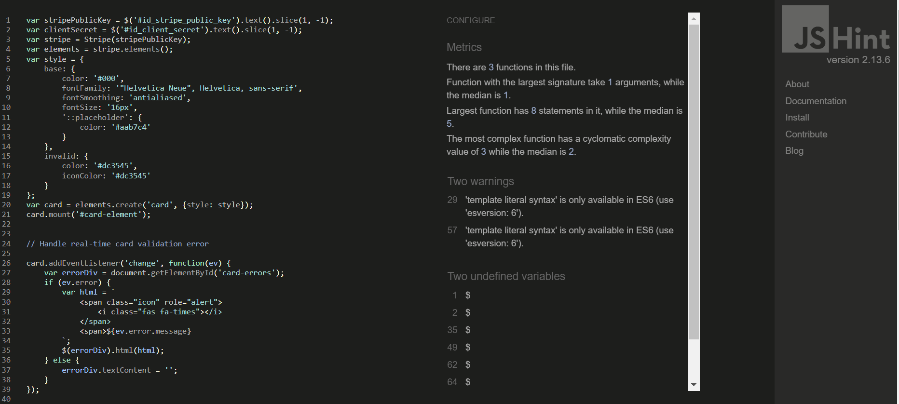

## Table of Contents

- [Responsiveness](#responsiveness)
- [Browser Compatibility](#browser-compatibility)
- [Bugs](#bugs)
- [Lighthouse](#lighthouse)
- [Validators](#validators)
- [User Stories](#user-stories)
- [Features](#features)   

### Responsiveness

Testing confirms that the website adapts to different devices and screen dimensions. From larger desktop monitors to smaller mobile screens, the website seamlessly adjusts its layout and elements to ensure a consistent and engaging user experience.

| Page| Screenshort|
|:-------:|:-------:|
| Home| |
| Product page| |
| Register page| 

 

### Browser Compatibility

**Browser Compatibility Testing:**

Testing has been conducted, focusing on key browsers such as Chrome, Edge, and Firefox. The outcome demonstrates that the website functions as anticipated across these platforms. This includes:
- correct display of information, 
- flawless functionality for tasks such as:
  - adding products to the basket, 
  - setting quantities, 
  - choosing shipping method, 
  - applying coupon codes, 
  - completing the checkout process, 
  - leaving and updating reviews.

| Browser | Screenshot |
|:-------:|:-------:|
| Chrome||
| Mozilla Firefox| |
| Microsoft Edge| |

### Bugs

| Description | Action | Status |
|:-----|:------|:------:|

### Lighthouse

### Validators

#### HTML

Home page
missing `<ul>` and duplicating 'id' in navbar

Product page
spelling mistakes ``

Add/ Edit product
??

Basket
stray tag

Checkout
duplicated 'for label'

Success page
clean

Profile
clean
*The type attribute is unnecessary for JavaScript resources

#### CSS

base.css

checkout.css

product-rating.css

#### JavaScript

home app / script.js

basket app / script.js

checkout app / stripe_elements.js

profiles app / script.js

#### Python

- **home app**

  

views.py

  
  
 

- **basket app**

  

context.py

  
  

  

views.py

  
  
 

- **checkout app**

    

forms.py

    
    

    

models.py

    
    

    

views.py

    
    
 

- **coupons app**

  

models.py

  
  

  

views.py

  
  
 

- **products app**

    

forms.py

    
    

    

models.py

    
    

    

views.py

    
    
 

- **profiles app**

    

forms.py

    
    

    

models.py

    
    

    

views.py

    
    
 

- **shipping app**

    

forms.py

    
    

    

models.py

    
    

    

views.py

    
    
 

### User Stories

"As a User I want to be able to___________________"
- [x] - *successfully implemented*
- [ ] - *yet to be implemented*  

- [x] As a Shopper I want to be able to *view all products*.
- [x] As a Shopper I want to be able to *view an individual product* details, so that I can get full info about the product.
- [x] As a Shopper I want to be able to *sort the products* by name, price, category and ratings, so that I can easily identify products that are more relevant to my preferences.
- [x] As a Shopper I want to be able to *search for a product* by name or description, so that I can quickly locate and purchase a specific item.
- [x] As a Shopper I want to be able to *view the total amount of my purchases* at any time, so that I am aware of my spendings.
- [x] As a Shopper I want to be able to *select quantity of items* I wish to purchase, so that I can buy the desired quantity with ease.
- [x] As a Shopper I want to be able to *view all items in my Basket* before placing my order , so that I can see the total cost of my purchase and review the items I will receive.
- [x] As a Shopper I want to be able to *select shipping options*, so that I can choose the shipping method that best suits my needs.
- [x] As a Shopper I want to be able to *apply my discount coupon* during checkout, so that I can benefit of the associated discounts.
- [x] As a Shopper I want to be able to easily *make payment*, so that I can checkout quickly and seamlessly.
- [x] As a Shopper I want to be able to *view order confirmation* and summary after checkout, so that I can verify the details and ensure there are no mistakes.
- [x] As a Shopper I want to *receive an email confirmation* after checkout, so that I can have a record of my order details for reference.
- [x] As a Shopper I want to be able to *view product reviews*, so that I can make informed choices and select products that best meet my needs.
- [x] As a Site owner I want to be able to *add a new product*, update existing products and delete outdated products, so that I can effectively manage and maintain an organized and up-to-date shop.
- [x] As a Shop owner I want my website to *have good search engine optimization*, so that I can improve visibility of my shop in Internet and increase the chances of converting visitors into customers.
- [x] As a Shop owner I want to be *able to send Newsletters* to my customers, so that I can share updates, and promote new products or offers.
- [x] As a Site user I want to be able to *easily register for an account*, so that I can store my data and view my orders.
- [x] As a Site user I want to be able to easily *log in and log out*, so that I can access my personal information.
- [ ] As a Site user I want to be able to *sign up and sign in using my social media account*, so that I can conveniently access the site without the need for creating separate login credentials and easily connect with my social media profile.
- [ ] As a Site user I want to be able to easily *recover my password* if I forget it, so that I can recover access to my profile.

### Features

| Page | User action | Expected result | Status|
|:-----|:------------|:----------------|:-----:|
|**User registration and authentication**| | | |
| Sign up | Enter username | Field will only accept letters, numbers, and @/./+/-/_ characters| pass|
| | Enter valid email| Field will only accept email address format | pass|
| | Enter valid password (x2)| Field will only accept password format: min. 8 characters|pass|
| | Click Sing in link | Redirect to sign-in page|pass|
| | Click Sign up button| Register user and redirect to home page|pass|
|Sign in| Enter valid username| Filed only accept valid username|pass|
| | Enter valid password| Field will only accept existing password format|pass|
| | Click Sign up link| Redirect to sign-up page|pass|
| | Click Sign in button| Redirect to home page|pass|
|Sign out| Click Sign out link|Redirect to confirmation page|pass|
| | Click Sign out button| Sign out and redirect to Log-in page|pass|
| ||||
|**View product**| | | |
| Home page | Click product picture or product title| Redirect to produt details page| pass|
| ||||
|**Product details**| | | |
| | Click "-" or "+" quantity button| Subtract or add quantity| pass|
| | Click Add to basket button| Add product to basket| pass|
| | Click Keep Shopping button| Redirect to home page| pass|
| ||||
|**View Basket**| | | |
| | Click Basket icon| Redirect to basket page| pass|
| | 1. Click "+" or "-"  2. Click "Update" link| Update items quantity| pass|
| | Click Remove link| Remove item| pass|
| | 1. Choose Shipping option  2. Click Choose button| Display shipping cost and add it to Grand total| pass|
| | 1. Enter coupon code  2. Click Apply button| Display discount applied and add it to Grand total| pass|
| ||||
|**Checkout**| | | |
| | Click Back to Basket button| Redirect to basket page| pass|
| | 1. Fill out form  2. Click Complete Order button| 1. Order processed  2. Redirect to Success page  3. Receive confirmation email| pass|
| ||||
|**Reviews**| | | |
| | Click star icons 1 through 5| Set rating 1 through 5| pass|
| | Click Post your Review button| 1. Publish review  2. Set raing on a product| pass|
| | If product is already reviewed by the user and user submits the review again| Update review| pass|
 ||||
|**Admin functionality**| | | |
| Navbar| Choose Product Management| Redirect to Add Product page| pass|
| Add Product page| Choose category from dropdown menu| Set category| pass|
| | Click Select Image button| Open window to select image| pass|
| | 1. Fill out form  2. Click Add Product button| Add new product to the shop| pass|
| | Click Cancel button| Redirect to home page| pass|
| Product detail page| Click Edit link| Redirect to Edit Product page| pass|
| |Click Select Image button| 1. Open window to select image  2. Replace image| pass|
| | Check Remove image| Remove image on submitting product update| pass|
| | Click Update Product button| Update product| pass|
| | Click Cancel button| 1. Discard changes  2. Redirect to home page| pass|
| Product detail page| Click Delete link| 1. Prompt to confirm delete action  2. Delete product  3. Redirect to home page| pass|
| Home page, announcemetn section| Click Update link| Redirect to announcement page| pass|
| | 1. Update text  2. Click Update button| 1. Update announcement  2. Redirect to home page| *pass|
| ||||
|**Sort products**| | | |
||Click sidebar category| | |
||Click 'sort by' dropdown |||
| ||||
|**Search product**| | | |
|| Enter a word in seach bar| | |
| ||||
|**Scroll to top button**| | | |
| Home page and basket| Scroll down| Button appear| pass|
| | Click button| Scroll up| pass|
| ||||
|**View product details**| | | |

 
Back to [README.md](https://github.com/e-kai00/gungnir-shop#gungnir-shop)

